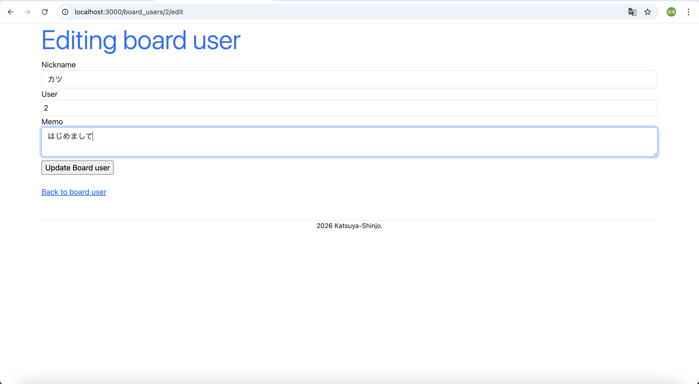
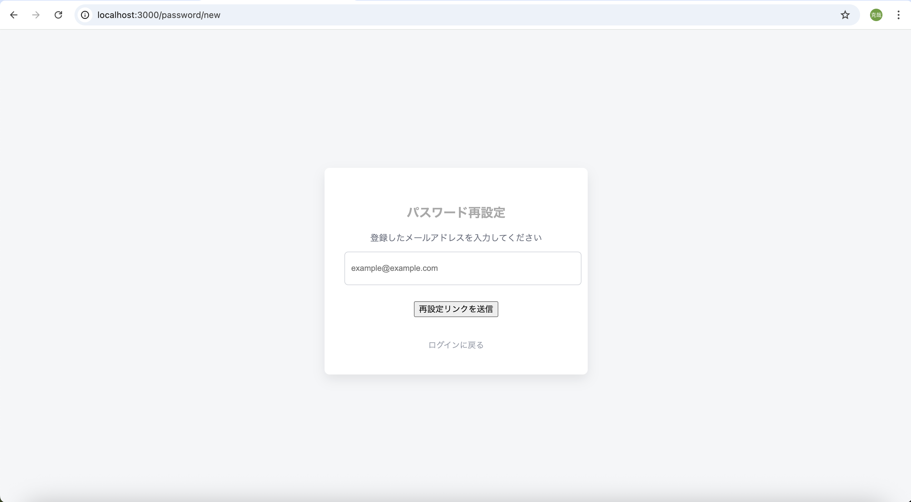

# rails-portfolio

Ruby on Railsで開発した認証機能付き掲示板アプリです。  
ユーザー管理・CRUD処理・認証ロジックの理解を目的として開発しました。

---

##  概要

ユーザー登録・ログイン機能を備えた掲示板アプリです。  
セッション管理・パスワードリセット・アクセス制御を実装し、  
Webアプリケーションの基礎構造を一通り理解することを目的としました。

---

##  使用技術

- Ruby 3.3.10
- Ruby on Rails 8.1.2
- Puma 7.1.0
- SQLite3
- Hotwire（Turbo）
- Git / GitHub

---

##  主な機能

- ユーザー新規登録
- ログイン / ログアウト（セッション管理）
- 投稿の作成・編集・削除（CRUD）
- パスワードリセット機能
- フラッシュメッセージ表示
- ログインユーザー以外のアクセス制限

---

##  工夫した点

- `before_action` を活用し認証処理を共通化
- Strong Parameters によるセキュリティ対策
- コントローラーの責務を整理し可読性を向上
- Issue を作成し、機能単位でブランチ管理・コミット
- 不要コード削除などのリファクタリングを実施
- RSpec導入とUserモデルのバリデーションテスト追加

---

##  今後追加予定

- AWSへの本番デプロイ
- UI/UX改善
- Docker環境の最適化

---

##  アプリ画面

### ログイン画面

### 投稿一覧

### プリフィール

### パスワード再設定1

### パスワード再設定2

