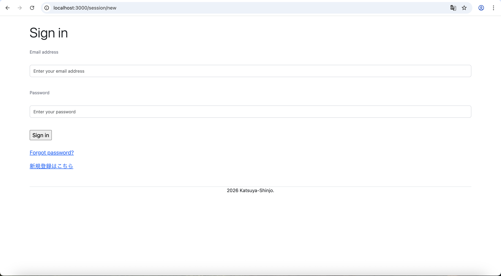
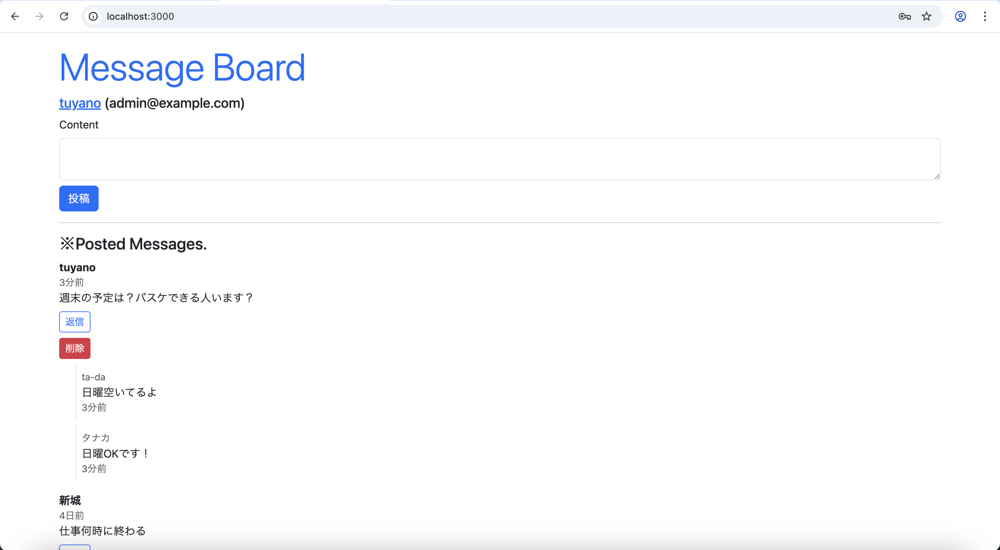
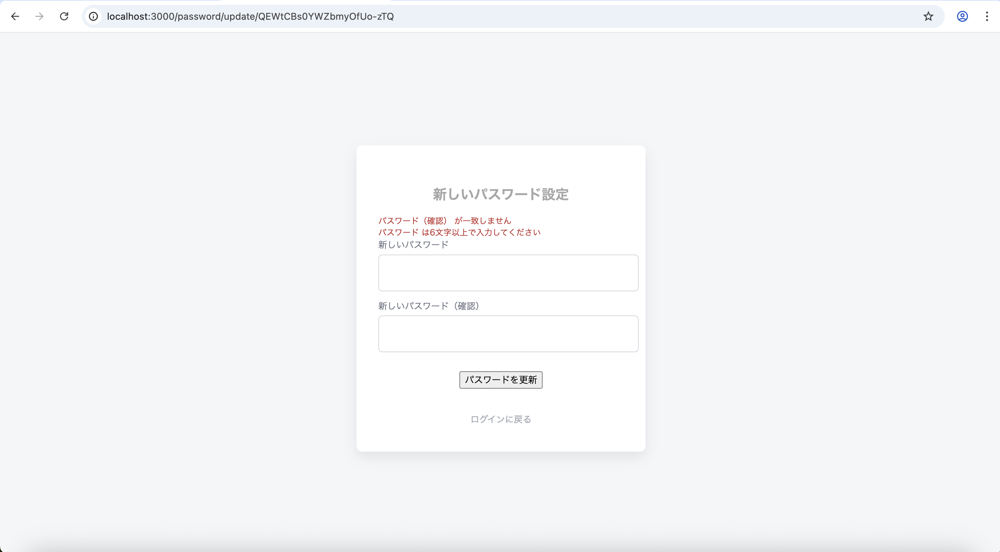

# rails-portfolio
Ruby on Railsで開発した掲示板アプリです。
ユーザー認証・投稿機能・パスワードリセット機能を実装しています。

## 概要
ユーザー登録・ログイン機能付きの掲示板アプリです。
CRUD機能と認証処理の理解を深めるために開発しました。

## 使用技術
- Ruby 3.3.10
- Ruby on Rails 8.1.2
- Puma 7.1.0
- SQLite3
- Hotwire（Turbo）
- Git / GitHub

## 主な機能
- ユーザー新規登録
- ログイン / ログアウト
- 投稿の作成・編集・削除
- パスワードリセット機能
- フラッシュメッセージ表示

## 工夫した点
- before_actionを活用し認証処理を共通化
- Strong Parametersでセキュリティ対策
- コントローラーをリファクタリングし可読性向上
- Issueを作成し、修正ごとにコミット管理

## 今後追加したい機能
- RSpecによるテスト追加
- AWSへ本番デプロイ
- UI改善

- ## アプリ画面

### ログイン画面

### 投稿一覧

### パスワード再設定

